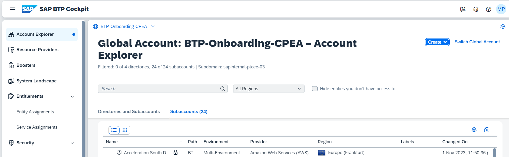
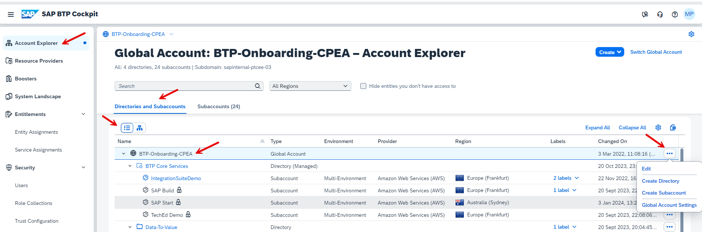
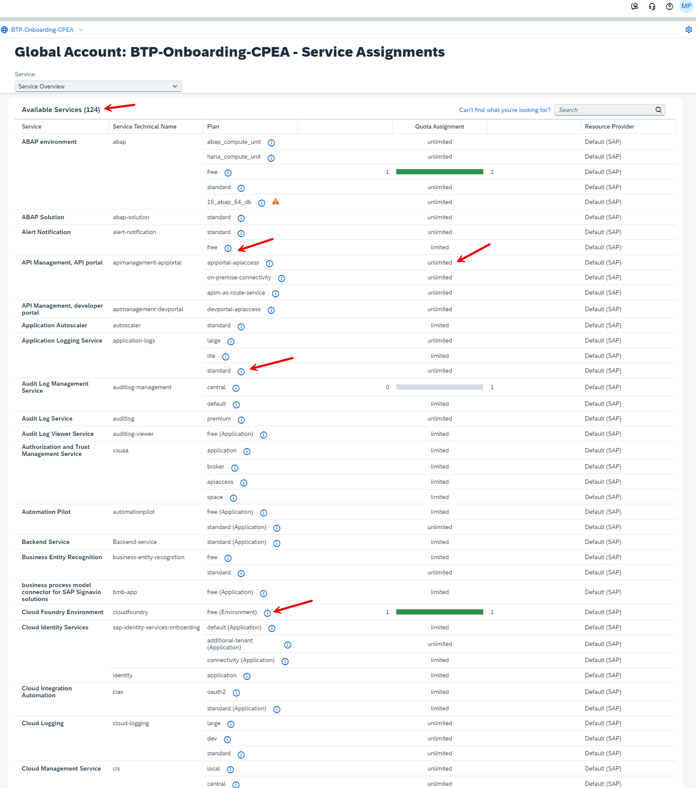

# Setup your Global Account of your SAP BTP Enterprise Account

This tutorial of the mission "Get Started with SAP BTP Enterprise Account" guides you through your first steps to access the Global Account of your SAP BTP Enterprise Account and to make the initial configurations.

## You will learn
  - Find the right emails to access your BTP tenant  
  - Your initial login to your Global Account
  - Add additional Global Administrators (recommended)
  - Change the display name of your Global Account
  - Check your Entitlements for the Global Account

### Prepare Your E-Mails

#### Check your first mail: IT Contact for your SAP BTP tenant
While you get started with your BTP Account, this would be the very first step – a “ Welcome Email” will be sent once your account is getting ready to be provisioned from SAP (no.reply.provisioning@sap.com).

>**Note:** This mail is sent to the IT Contact person of your company whose ID was provided during the contract signing process. The initial SAP BTP Global Account access is provided to only the IT Contact and it would be his/her responsibility to add additional Global Administrators and delegate the work as required. 

In case you are not the IT Contact person and have received the BTP login details from your Administrator, you can stop here and continue with the next steps. However, it would be good to understand the process.

The welcome email address sample is shown below:

 <!-- border -->

#### Check your second mail: Logon Information for your SAP BTP tenant

You will receive your second email from the platform services team shortly before the contract start date. Look for these emails for the confirmation of account setup and access.

 <!-- border -->

It contains an **S-user**, which can also be used for SAP Store, SAP Support, SAP.com.

The S-user of the Global Account Administrator is attached to your licensed SAP BTP Global Account and your entitlements from your consumption or subscription license. You must log on with the correct URL and user credentials to Administrate your global account.

If you are working with many SAP solutions, you may want to check your assigned SAP S-Users (you might have more than one) independent from SAP BTP with [SAP ID Service](https://accounts.sap.com/).  

### Getting Support in SAP for Me

To get assistance, use the available support channels provided by SAP for Me. To report a case in SAP for Me, proceed as follows:

  1. Open [SAP for Me](https://me.sap.com/) and log on.

  2. Open the Services & Support dashboard.
  3. Use the Get Support application within SAP for Me to get assistance via the available support channels.

Optionally you can use the Knowledge Search tab for existing solutions in:

 - SAP Notes & KBAs
 - SAP Community
 - SAP Support Portal
 - Product Documentation
 - Guided Answers

For any other non-technical assistance, see [Customer Interaction Center](https://support.sap.com/en/contact-us.html?anchorId=section_42886245).

### Your initial login to your Global Account

Use the link from the email if it’s a first attempt to log into your BTP account, else you may use the direct link [SAP BTP Cockpit Home](https://account.hana.ondemand.com/#/home/welcome). 

>**Note:** For the first login to SAP BTP Enterprise Accounts, it is important to log on with the Global Account Administrator credentials that you received in your e-mail. In case you are not an administrator, the best option is to contact your Administrator for access.

<!-- border --> 

Click "Sign In". 

**Result:** You get forwarded to the SAP BTP Cockpit Home and see your Global Account(s):

 <!-- border -->

To get an overall understanding of your **BTP Global Account Cockpit**, look at the blog [SAP BTP Cockpit – Global Account Technical Overview](https://blogs.sap.com/2022/01/04/sap-btp-onboarding-series-sap-btp-cockpit-global-account-technical-overview/).

### Add Additional Global Account Members

As Global Account Administrator you can add additional users as global account members using the SAP BTP cockpit.

>**Note:** SAP recommends that you create **at least one additional Global Account Administrator** who can support or substitute 
the initial Global Account Administrator if necessary. SAP cannot assign additional user IDs on your company's behalf.

>**Note:** All global account members have global account administrator permissions for the global account. 
Adding members to global accounts is only possible in enterprise accounts, not in trial accounts.

#### Procedure

1. Choose the global account to which you'd like to add members.
2. In the navigation area, choose Security and Users.
3. Choose "Create".
4. Enter one or more e-mail addresses, separated by commas, spaces, semicolons, or line breaks. The users you add as members at the global account level are automatically assigned the Administrator role.
5. You may check the assigned "Roles" under "Role Collections".

    <!-- border -->

For more information, see SAP Help Portal [Add Members to Your Global Account](help.sap.com/docs/BTP/65de2977205c403bbc107264b8eccf4b/add-members-to-your-global-account?locale=en-US).

### Change the Display Name of Your Global Account

Members of the global account can change the name of the global account.

#### Procedure

1. In the Account Explorer view, click on Directories and Subaccounts, select the table view and then select the global account for which you'd like to change the display name and select the "Edit"-pencil on its tile towards the right of the screen
2. A new dialog shows up with the mandatory Display Name field that is to be changed
3. Enter the name of your choice and save your changes

    <!-- border -->

### Check your Entitlements for the Global Account

When you purchase an enterprise account, you are entitled to use a specific set of resources, such as the amount of memory that can be allocated to your applications. In a Consumption or PAYG Account, you have access to pretty much all the services that are available with an unlimited quota, in case you are on a subscription model, you will be able to see the services and their limits based on your license model. 

An **entitlement** is your right to provision and consumes a resource. In other words, entitlements are the **service plans** that you're entitled to use.

A **quota** represents the numeric quantity that defines the maximum allowed consumption of a resource. In other words, how much of a service plan you're entitled to use (limits).

**SAP BTP Services** can be business services or technical services. You find all available services and solutions in the SAP Discovery Center.

The figure shows an example of available services in a global account CPEA Model:

 <!-- border -->

The above images list all the 105 services and help us to identify the Standard cost vs free tier services with its quota of assignments (limited/unlimited).

**Note:** Each instance of services that you activate in your subaccount is considered individual and charged based on the pricing listed in [Discovery Center Services](https://discovery-center.cloud.sap/viewServices?).

The image below is an example of a subscription model:

 <!-- border -->

To get an overall understanding of your **BTP Global Account Cockpit**, look at the blog [SAP BTP Cockpit – Global Account Technical Overview](https://blogs.sap.com/2022/01/04/sap-btp-onboarding-series-sap-btp-cockpit-global-account-technical-overview/).
