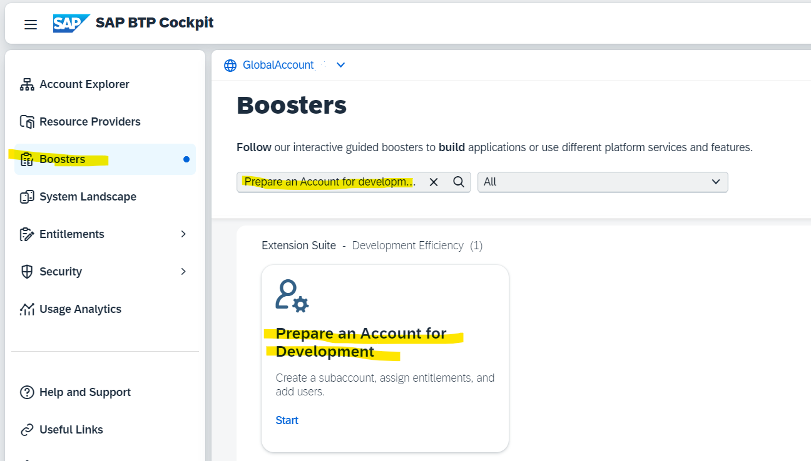
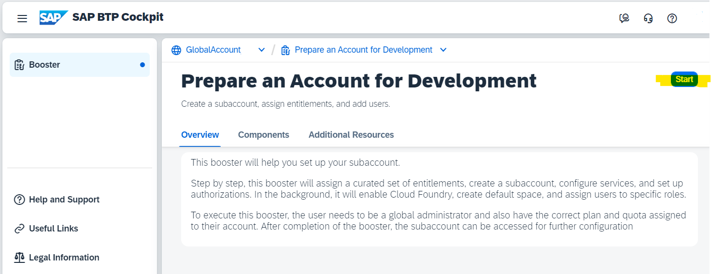

# Create a Cloud Foundry Subaccount with a Booster

This tutorial for the mission "Get Started with SAP BTP Enterprise Account" guides you through the steps to create your first Subaccount in your SAP BTP Global Enterprise Account with the help of an SAP BTP Booster.

### Use a Booster for creating a Cloud Foundry Subaccount

You need at least one Subaccount in an SAP BTP Global Account to run your BTP services.

You can create a Subaccount manually, which you can do later in the mission, or use an SAP BTP **Booster**. A booster is a wizard-based step-by-step configuration UI in SAP BTP cockpit for achieving a defined tasks. In this tutorial, you will use the Booster "Prepare an Account for Development," which will create a Subaccount and enable Cloud Foundry (CF) in this Subaccount.

Note: You can delete your Subaccount if you do not need it anymore.

You can find Boosters under your global account navigation entry **Boosters**.

### Run Booster "Prepare an Account for Development"

In this tutorial, you will use the Booster **Prepare an Account for Development**, which will create a Subaccount and enable the SAP BTP, Cloud Foundry Runtime (CF) for this Subaccount.

The Booster creates a subaccount, assigns a curated set of entitlements, creates a CF Organisation and CF Space, and assigns users to the Subaccount with the required roles for authorization. 

In the boosters overview, select the booster "Prepare an Account for Development," read the "Overview" description, and check the required "Components." An Entitlement of "Cloud Foundry Runtime" is required for this Booster, which means your Global Account is entitled to use Cloud Foundry runtime. 

#### Procedure

Press **Start** to run the Booster.

### Booster Step 1 - Check Prerequisites

The prerequisites will be checked and marked as green if authorizations and entitlements are fulfilled. Click **Next** to continue.

Click **Next** to continue.

### Booster Step 2 - Set Up Subaccount

Provide your details in the booster form:

1. A subaccount name of your choice.

2. Choose Provider (Note: Only multi-cloud providers support Cloud Foundry runtime. SAP Data Center cannot be selected).

3. Region (Choose a region near your location)
4. Subdomain (Note: Subdomain name is used as URL access and it cannot be changed once created).
5. Org name of your choice
6. Provide a Space name (typically DEV, TEST, or PROD)

7. Click on **Next**.

### Booster Step 3 - Add Users

Provide suSubaccountdmin users and the developers who will be accessing the system. Click on Next.

### Step 4 - Review and Run Booster

Check the summary of the subaccount details before you execute the Booster.

Press **Finish**, and the Booster will be executed.

You should be able to see that your Booster is executed successfully.

After completion, the Subaccount can be accessed for further configuration and development.

