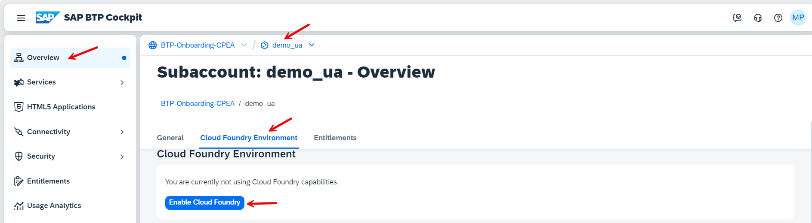
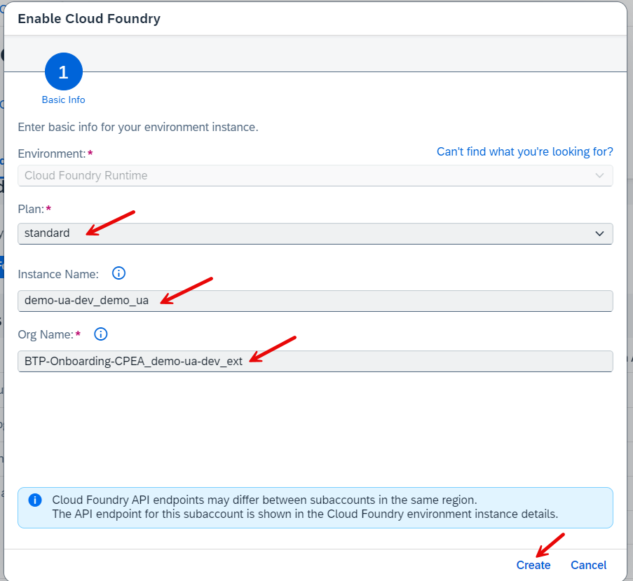
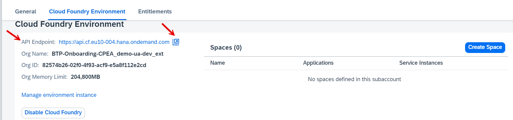
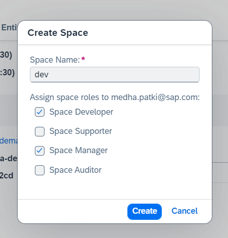
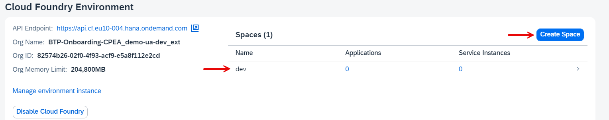
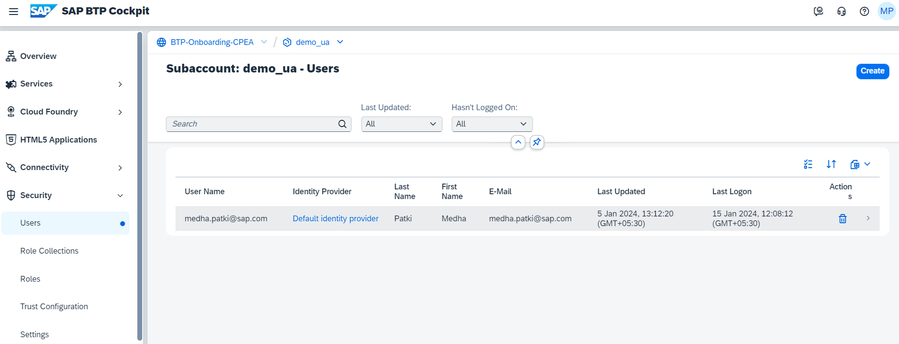

# Create a Cloud Foundry Subaccount manually

This tutorial for the mission "Get Started with SAP BTP Enterprise Account" guides you through the first steps to create your first Subaccount in your SAP BTP Global Enterprise Account and perform the initial configurations.

You need at least one subaccount in an SAP BTP Global Account to run your BTP services. 

If you have already created one subaccount using a booster, you can create a second manually. Don´t worry, you can delete subaccounts, which you do not need anymore.

### Create a Subaccount manually

Creating a subaccount can be one of the easiest tasks. However, one has to keep in mind the Hosting region, Naming conventions, Account Model, Labels, Authorizations, etc.

Before you start creating your subaccounts, we recommend understanding the basic details in this blog - [SAP BTP Cockpit – Global Account Technical Overview](https://blogs.sap.com/2022/01/04/sap-btp-onboarding-series-sap-btp-cockpit-global-account-technical-overview/) - section 3 and if you want to know about the account models and directories, you can read - [How to Determine your Account Model](https://blogs.sap.com/2021/12/17/sap-btp-onboarding-series-how-to-determine-your-account-model/).

#### Procedure

Now let us take a look at the details on creating the Subaccount manually.

1. From your global account home page, Click on the "Create" drop-down button and choose Subaccount.

2. Specify a display name.

3. (Optional) Specify a description.

4. Select the region, environment, and infrastructure provider of the new subaccount. 

    Additional fields appear according to the selected environment. Select settings as required.

    **Note:** In a subaccount in the Cloud Foundry environment, the subdomain that you specify can be any string. The subdomain can contain only lowercase letters and digits, and hyphens (not allowed at the beginning or at the end) and must be unique within the Cloud Foundry environment of SAP BTP. 

5. (Optional) To use beta features in the subaccount, select "Enable beta features".

6. Save your changes.

#### Result

A new tile appears on the Global Account page with the subaccount details. 

For more information see SAP Help Portal, [Create a Subaccounts](https://help.sap.com/docs/btp/sap-business-technology-platform/create-subaccount). 

### Enable Cloud Foundry Environment in Your Subaccount

After you have created your subaccount, you need to enable its runtimes. Runtimes can be either Cloud Foundry, Kyma, or ABAP. 

This tutorial enables **Cloud Foundry runtime**. Guides for the other runtimes can be found in dedicated tutorials or missions.

#### Procedure

1. Open your BTP Cockpit.
2. Select the subaccount, you just created.
3. Select **Cloud Foundry Environment** in the tab navigation.
4. Check the button "Enable Cloud Foundry".
   
    

5. A form opens. Keep the preconfigured values or change the following entries: 

    - **Plan**: One of the Service Plans you are entitled to (e.g. standard, or free)
    - **Landscape**: Some Regions have more than one Landscape.
    - **Instance Name**: Consider a CLI-friendly name 
    - **Org Name**: Each Cloud Foundry environment has exactly one Organization.
   
    

6. Choose `Create`.

7. The Cloud Foundry Environment will be created.
   
    Note your API Endpoint. Copy and call it in a browser. You will need it in other tutorials. 

    Note: You still have no Cloud Foundry "Spaces". You will need at least one.

### Create Spaces in your Cloud Foundry Environment

After you have enabled Cloud Foundry runtime, you can create a space. There is no limit to how many spaces you can have within one org.

Spaces can be used to separate a DEV from a TEST or PROD environment. A typical setup for a BTP environment is the Staged Development Environment with DEV, TEST, and PROD landscape for each project.

For more information, see SAP Help - [Setting Up Your Account Model](https://help.sap.com/docs/btp/best-practices/setting-up-your-account-model?locale=en-US).

#### Procedure

1. In your subaccount overview page, choose "Cloud Foundry Environment" again.

2. Press the button `Create Space`.

3. A popup form opens.

4. Provide a name  (choose "dev" if you have no name).

5. Keep the **space roles** as preconfigured and choose `Create`.

6. Congratulations you now have a configured Cloud Foundry Environment.

For more information, see [Managing Spaces](https://help.sap.com/docs/BTP/65de2977205c403bbc107264b8eccf4b/managing-spaces?locale=en-US) on the SAP Help Portal.

### Add Members to Subaccount

The default **SAP BTP identity provider** and application identity provider of SAP BTP is the **SAP ID service**. Trust that the SAP ID service in your subaccount is pre-configured by default, so you can start using it without further configuration. 

For more information about SAP ID Service see [SAP Help Portal](https://help.sap.com/docs/BTP/65de2977205c403bbc107264b8eccf4b/default-identity-provider?locale=en-US).

For more information, or on how to establish trust with your custom identity provider, start the Discovery Center mission [Establish single sign-on to your cloud solutions](https://discovery-center.cloud.sap/missiondetail/3114/3151/).

#### Users

If you want to grant authorizations to users from the SAP ID service in your subaccount, you must ensure that they have a user account in the SAP ID service.

For more information see [Working with Users](https://help.sap.com/docs/btp/sap-business-technology-platform/working-with-users). 

#### Roles and Role Collections

Roles determine which functions in the cockpit users can view and access, and which actions they can initiate.

SAP BTP offers predefined "Role Collections", which are sufficient for this mission.

For more information see [Working with Role Collections](https://help.sap.com/docs/btp/sap-business-technology-platform/working-with-role-collections)). 

#### Procedure

1. Open the SAP BTP cockpit.

2. Choose the subaccount to which you'd like to add users.

3. In the navigation pane, choose "Security" and then "Users".

4. All members currently assigned to the subaccount are shown in a list.

5. Choose `Create`.

6. Enter the user ID and e-mail address.

7. Choose the identity provider where the user is stored. The dropdown list displays the identity providers configured in your subaccount's trust configuration.

8. `Save` your changes.

You can now proceed to assign role collections to the new user. Browse the list of available Role Collections by clicking on "Role Collections".

### Delete a Subaccount

If you want to delete your subaccount, e.g. because it was a test or sandbox subaccount, you can delete unused subaccounts.

>**Note:** Only subaccount administrators can remove such content from a subaccount.

#### Procedure

1. Login to SAP BTP Cockpit.
2. Choose the subaccount that you want to delete.
3. The subaccount doesn't contain any active subscriptions, service instances, brokers, or platforms.
4. Choose `Delete Subaccount` and confirm the operation.

