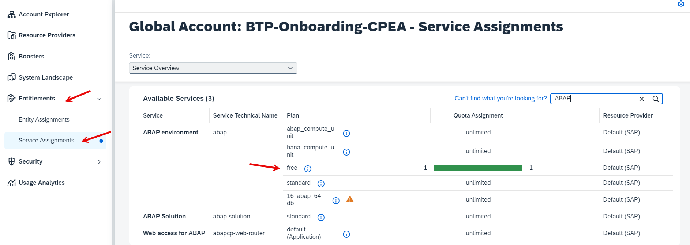
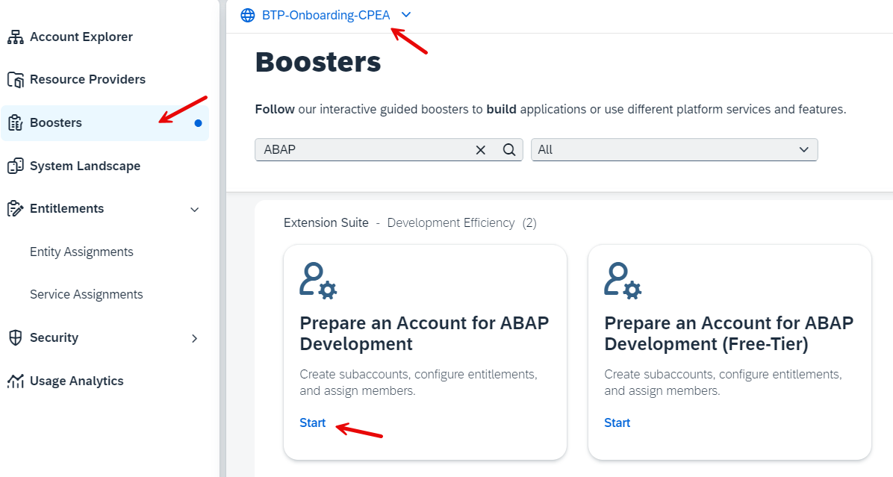
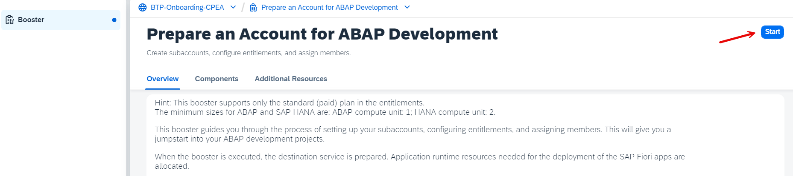
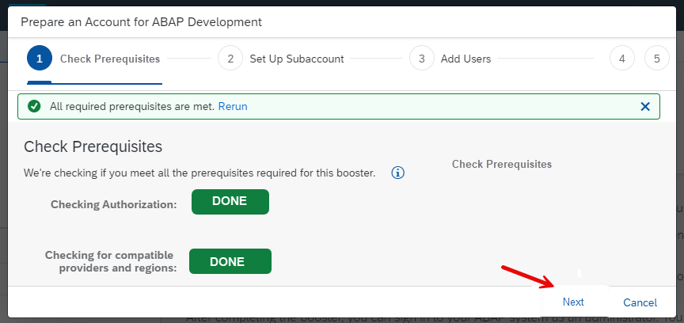
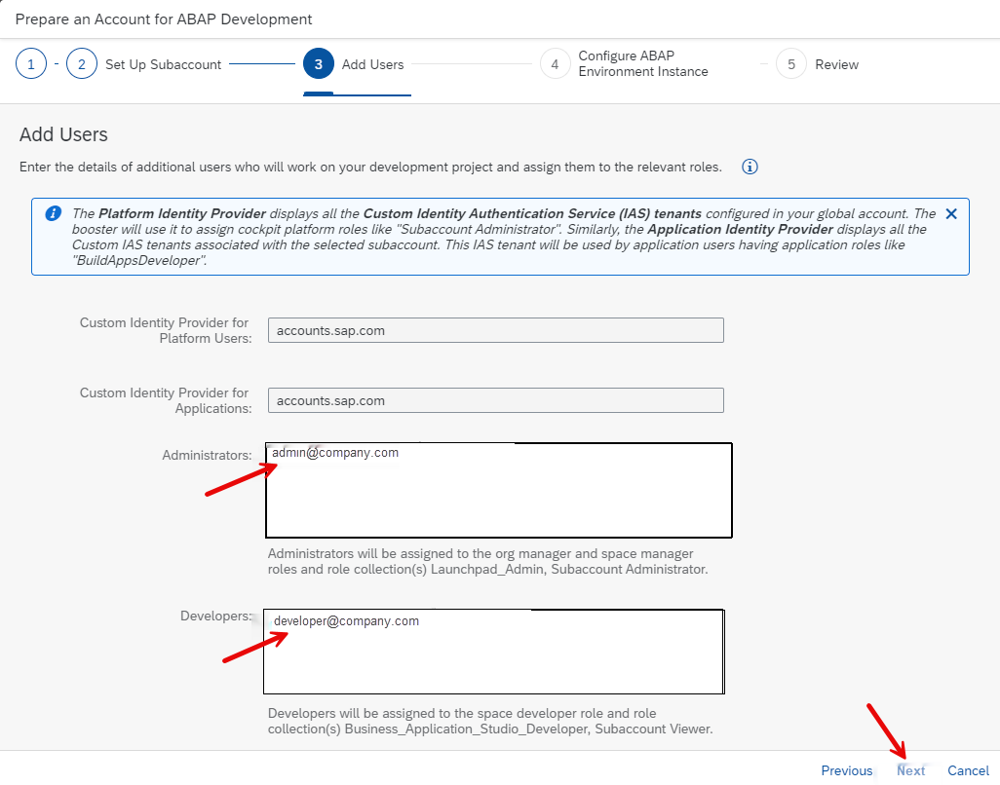
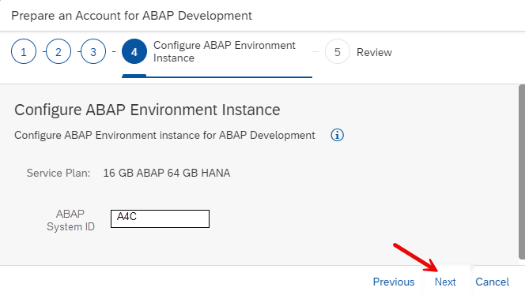
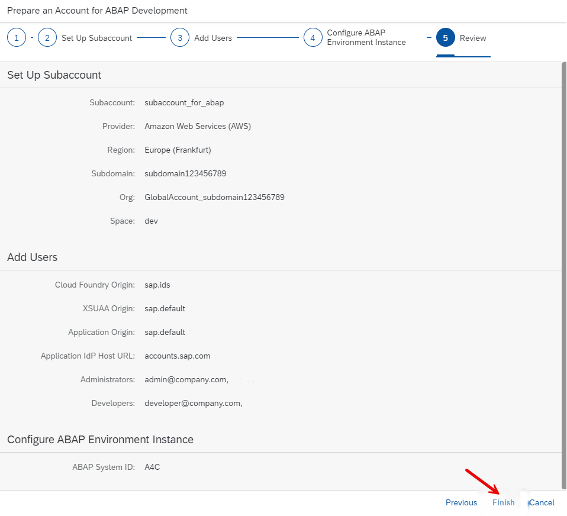
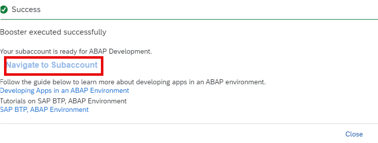
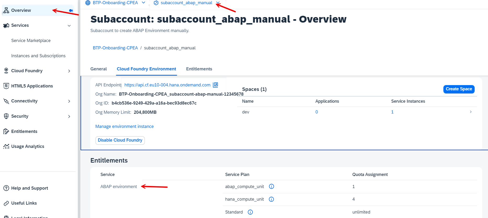
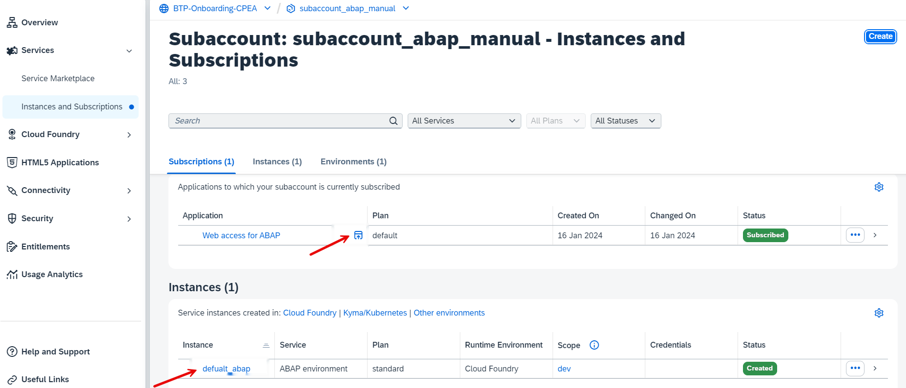

# Use a Booster for creating a Subaccount with an ABAP Environment

You need a subaccount in your SAP BTP Global Account in order to run your ABAP environment.

You can use an existing subaccount, if ABAP runtime is available in your region. you can check this in [Discovery Center](https://discovery-center.cloud.sap/serviceCatalog?showFilters=true).

You can create a subaccount and your ABAP environment manually, or you can use a **“Booster”** from SAP BTP Cockpit. A booster is a wizard-based step-by-step UI for achieving defined tasks in configuration, like setting up a ABAP environment.  

### Check your Global Account Entitlements for ABAP

First, before you run the booster, check that your Global Account is entitled for the ABAP Environment.

In your Global Account, navigate to Entitlements --> Service Assignments. 

Search for "ABAP" to reduce the list. Make sure you are entitled and have free, unused Quota:

 <!-- border -->

### Find Boosters in Cloud Cockpit

You can find boosters under the navigation entry "boosters" in your global account.

### Run Booster "Prepare an Account for ABAP Development”

In this mission, we are using the booster **"Prepare an Account for ABAP Development”** which helps you to create a Cloud Foundry subaccount for developing ABAP applications.

Step by step, the booster assigns a curated set of entitlements, creates a subaccount, configures services, and sets up authorizations. 

In the background, it enables Cloud Foundry, creates default space, and assigns users to specific roles.

In the boosters overview, select the booster "Prepare an Account for ABAP Development", read the "Overview" description, and check the required "components". Entitlement of "Cloud Foundry Runtime" is required, which means your Global Account is entitled to use Cloud Foundry runtime. 

Press **"Start"** to start the booster.

### Booster Step 1 - Check Prerequisites

In the first step, the prerequisites fpr an ABAP subaccount are checked. 

Option "Failed": If the boosters fails, it will tell you what is missing:

 <!-- border -->

Option "Done": If the boosters passes, the check is marked as green - authorizations and entitlements are fulfilled. 

 <!-- border -->

Click "Next" to continue.

### Booster Step 2 - Set Up Subaccount

Provide the following entries to the booster:

1. Entitlements
   
    See the picture for a minimum set-up. Note: you need at least 4 units Quota for **hana_compute_unit**.

    <!-- border -->

2. A subaccount name of your choice.

3. Provider (Note: Only multi-cloud providers support Cloud Foundry runtime. SAP Data Center cannot be selected).

4. Region (Typically near your location).

5. Subdomain (Note: Subdomain name is used as URL access and it cannot be changed once created).

6. Org name of your choice.

7. Space name (typically DEV, TEST, or PROD).

8. Click on **Next**.

 

### Booster Step 3 - Add Users

Your user is pre-configured as Admin and Developer. You may add additional subaccount admin users and developers. 

 <!-- border -->

Click on "Next".

### Booster Step 4 - Configure ABAP System ID

Must be 3 capital letters or digits.

 <!-- border -->

Choose "Next".

### Booster Step 5 - Review and Finish

1. Check the summary of the subaccount details before you execute the booster.

    <!-- border -->

2. Click **"Finish"** and the booster will be executed.

    <!-- border -->

3. After the booster has been executed successfully, you get a success popup.

    <!-- border -->

4. Click on "Navigate to Subaccount".

### Navigate to your new ABAP Subaccount

1. In your new Subaccount Overview page, check the newly created configuration

    <!-- border -->

2. Goto to Instances and Subscriptions in the left handed navigation pane:

    <!-- border -->

3. From here you can check your Web Access for ABAP.

    You just get a success message. 

    <!-- border -->

4. Discover your ABAP Admin Dashboard.

    Browse the dashboard to become familiar. The tutorial ends here. You will use the dashboard in advanced tutorials or missions.

    <!-- border -->

After completion, the subaccount can be accessed for further configuration and development.

