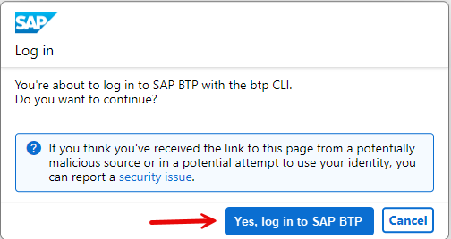

# Account Administration Using the SAP BTP Command Line Interface

The SAP BTP command-line interface (BTP CLI) can be used for all account administration tasks, such as creating or updating subaccounts, authorization management, and working with service brokers and platforms. 
It is an alternative to the SAP BTP cockpit for users who prefer to work in a terminal or automate operations using scripts.

>Note: "btp CLI" is the BTP Platform's command-line tool. It does not replace other CLIs, like the [Cloud Foundry CLI](https://tools.hana.ondemand.com/#cloud-btpcli), which you need for the Cloud Foundry runtime, or the [Kyma CLI](https://kyma-project.io/docs/kyma/latest/04-operation-guides/operations/01-install-kyma-CLI) for the Kyma runtime or Kubectl. 


### How BTP Command Line Interface works

You download the btp CLI client to your local desktop and access it through the shell of your operating system. 

The client then accesses all required platform services through its backend, the CLI server, where the command definitions are stored.


Figure: btp CLI Solution diagram

You can download the btp CLI from the [SAP BTP Developer Tools page](https://tools.hana.ondemand.com/#cloud-btpcli).


### Setup BTP CLI


To use the SAP BTP command line interface (btp CLI), you need to download the client first.

**Download btp CLI**

1. Download the SAP BTP Command Line Interface (btp CLI) client for your operating system from SAP Development Tools or use the direct links to the latest version below. They are tar.gz archives that contain one executable file.
   
    Search for "btp CLI" in [SAP Development Tools home page](https://tools.hana.ondemand.com/#cloud-btpcli)
   
    Or download the [latest Windows archive](https://tools.hana.ondemand.com/additional/btp-cli-windows-amd64-latest.tar.gz) directly.
   
2. Extract the archive using tar. Get details of tar with `tar --help`. 

    The general command for extract is: `TAR -xf <archive-filename>`.

    For example in windows: `C:\> tar -xvf C:\TARS\btp-cli-windows-amd64-2.33.0.tar.gz`

    ```
    -x: Extract.
    -v: Verbose.
    -f: Filename.
    ```
 
 3. Add the btp CLI to your system environment variables (e.g., PATH in Windows) or work in the btp CLI's directory.


**For more information, see**

  - SAP Tutorial [Get Started with the SAP BTP Command Line Interface (btp CLI)](https://developers.sap.com/tutorials/cp-sapcp-getstarted.html)
  - [SAP Help Portal](https://help.sap.com/docs/btp/sap-business-technology-platform/download-and-start-using-btp-cli-client)


### First Commands with btp CLI

For your first commands with btp CLI, you need no connection to the BTP platform.
On Windows, open your `CMD` or Powershell terminal. Type

1. `btp --version`. Should be the version you just downloaded.

2. `btp --help` gives you more details on btp CLI commands:

    ``` 
    Usage: btp [OPTIONS] ACTION GROUP/OBJECT PARAMS

    Each GROUP contains multiple OBJECTS, on which you can perform ACTIONS.

    ACTIONS:
        list, get, create, update, delete, add, remove, assign, unassign, enable,
        move, register, unregister, subscribe, unsubscribe, share, unshare

    GROUPS:
        accounts  Objects related to the account model, subscriptions, and environments
        security  Authorization objects and users
        services  Objects related to SAP Service Manager

    Example help calls:
        btp help list                                 Commands for ACTION "list"
        btp help accounts                             Objects in GROUP "accounts"
        btp help accounts/available-environment       Actions for OBJECT "available-environment"
        btp help list accounts/available-environment  Command-specific help
        btp help all                                  Overview of all commands

    General actions:
        help                  Display help
        feedback              Give us feedback
        login                 Log in to a global account of SAP BTP
        logout                Log out from SAP BTP
        target                Set the target for subsequent commands
        enable autocomplete   Enable command autocompletion
        disable autocomplete  Disable command autocompletion

    Options:
       --config   Specify the location of the configuration file
       --format   Change output format (valid value: json)
       --help     Display help
       --info     Show version and current context
       --verbose  Print tracing information for support
       --version  Print client version
    ``` 


3. `btp --info`. Gives you some information about fundamental configurations, like:

    ```
    Usage: btp [OPTIONS] ACTION GROUP/OBJECT PARAMS
    CLI server URL: https://cpcli.cf.eu10.hana.ondemand.com (server v2.38.1) (central CLI API, preconfigured)
    Configuration: (<your local folder>/config.json)
    ``` 
    
For more information see [btp CLI Command Reference](https://help.sap.com/docs/btp/btp-cli-command-reference/btp-cli-command-reference). 


### Log-in

**Prerequisites**

Your global account must be on feature set B. 

Your user is assigned to the Global Account Viewer or the Global Account Administrator role collection. 

When you log in to your global account with the btp CLI, a token is created and stored on your computer that allows to close and reopen the command line without losing your login. With each command call, this token is renewed and valid for 24 hours. For more information, see [SAP Help Portal](https://help.sap.com/docs/btp/sap-business-technology-platform/log-in)


#### Login with User and Password

1. Type `btp login`

2. Enter a `CLI server URL`. https://cpcli.cf.eu10.hana.ondemand.com is pre-configured. Accept with "enter" or provide a different server URL from your operator.

3. Enter a `User`, the email address for your BTP platform.

4. Enter a `Password`, your password for your BTP platform.

5. The result is for example (in case you have 3 Global Accounts):

    ```
    Authentication successful 

    Choose a global account:
       [1]  12345678trial
       [2]  GlobalAccount_A
       [3]  GlobalAccount_B
    Choose option>
    ```
   
6. Choose option, e.g. `2`. The result is for example on Windows:

    ```
    Current target:
    GlobalAccount_A (global account, subdomain: 1234567-8910-11....)

    We stored your configuration file at: C:\Users\<username>\AppData\Roaming\SAP\btp\config.json
    Microsoft Windows: C:\Users\<username>\AppData\Roaming\SAP\btp\config.json
    To change this location, use the --config option or the environment variable
    ```


#### Login with Single Sign-On


1. Type `btp login --sso`.

2. Enter "CLI server URL". Use a pre-configured URL [https://cpcli.cf.eu10.hana.ondemand.com] or enter your own.

3. A browser popup window will open. Confirm login.

    

4. The result is for example (in case you have 3 Global Accounts):

    ```
    Authentication successful 

    Choose a global account:
       [1]  12345678trial
       [2]  GlobalAccount_A
       [3]  GlobalAccount_B
    Choose option>
    ```
   
5. Choose option, e.g. `2`. The result is e.g. on Windows:

    ```
    Current target:
    GlobalAccount_A (global account, subdomain: 1234567-8910-11....)
    ```


### Change your btp target

Commands are executed in the **target specified otherwise using a parameter. To change the target, use `btp target`. <br>
In this example you choosed as target "GlobalAccount_A". <br>
If you want to change your target, type

1. `btp target`

2. the result is for example:

    ```
    Choose a subaccount or directory:
      [..]  Switch Global Accounts
       [.]  GlobalAccount_A (global account)
       [1]  └─  subaccounttest (subaccount)
    Choose, or hit ENTER to stay in 'GlobalAccount_A' [.]>
    ```

3. Type `..` to get a global account list, where you can choose your new global account.
  


### Logout

To log out, type `btp logout`.

This terminates your active logout session and ensures that all user-specific data is removed. The next time you log in, you will have to type in the subdomain of the global account and your user.

  


### Create a Subaccount with btp CLI


1. Check the details of your global account. Type `btp get accounts/global-account`.
2. Check existing subaccounts of your global account. Type `btp get accounts/global-account --show-hierarchy`.
3. Get help for btp create command. Type `btp --help create`
4. Optional, get detailed help. Type `btp --help create accounts/subaccount`
5. Get help with the available regions. Type `btp list accounts/available-region`.

6. Now that you have the required info, create the subaccount. 

    For example, choose **subaccounttest** as display-name and **eu10** as region (this will be Frankfurt). 

    As a subdomain, you may choose **mysubdomain12345**.Must be unique within the defined region. 
   
    `btp create accounts/subaccount --display-name subaccounttest --region eu10 --subdomain mysubdomain12345`

7. The result is
   
    ```
    Creating a subaccount in <your global account ID>...

    subaccount id:         <your ID for the subaccount>
    technical name:        N/A
    display name:          subaccounttest
    description:
    subdomain:             mysubdomain12345
    region:                eu10
    created by:            <your user email>
    beta-enabled:          false
    used for production:   false
    parent id:             <your ga ID>
    parent type:           global account
    state:                 Started

    Command runs in the background.
    Use 'btp get accounts/subaccount' to verify status.
 
    OK
    ```   
  
8. Check your subaccounts. 

    In the terminal, type: `btp list accounts/subaccount`

    It will list the subaccounts in your global account.
   
9. Open your global account in BTP Cockpit and check your new subaccount:

    


Congratulations! You made your first steps with btp CLI.


### More information and Tutorials

For further information, see 

* SAP Help Portal: [Account Administration Using the SAP BTP Command Line Interface](https://help.sap.com/docs/btp/sap-business-technology-platform/account-administration-using-sap-btp-command-line-interface-btp-cli-feature-set-b?locale=en-US). 
* SAP Help Portal: [Setting Up an Enterprise Global Account via the Command Line](https://help.sap.com/docs/btp/sap-business-technology-platform/setting-up-global-account-via-command-line?locale=en-US)
* SAP Help Portal: [Working with Global Accounts, Directories, and Subaccounts Using the btp CLI](https://help.sap.com/docs/btp/sap-business-technology-platform/working-with-global-accounts-directories-and-subaccounts-using-btp-cli?locale=en-US).
* SAP Help Portal: [Setting Up a Trial Account via the Command Line](https://help.sap.com/docs/btp/sap-business-technology-platform/setting-up-trial-account-via-command-line?locale=en-US)
* SAP Tutorial [Get Started with the SAP BTP Command Line Interface (btp CLI)](https://developers.sap.com/tutorials/cp-sapcp-getstarted.html)
* SAP Tutorial [Enable SAP BTP, Kyma Runtime Using the Command Line](https://developers.sap.com/tutorials/btp-cli-setup-kyma-cluster.html)
* SAP Tutorial (only Bash) [Automate Account Operations with the Command Line Interface (CLI)](https://developers.sap.com/tutorials/cp-cli-automate-operations.html)
* [SAP blog about BTP setup automator](https://blogs.sap.com/2022/03/17/automating-the-setup-of-your-sap-btp-account-with-btp-setup-automator/) for further information.
