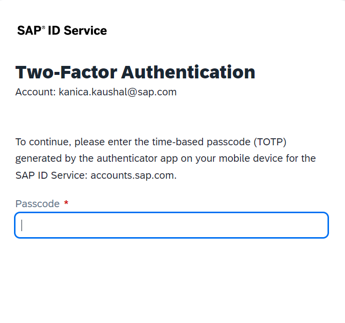
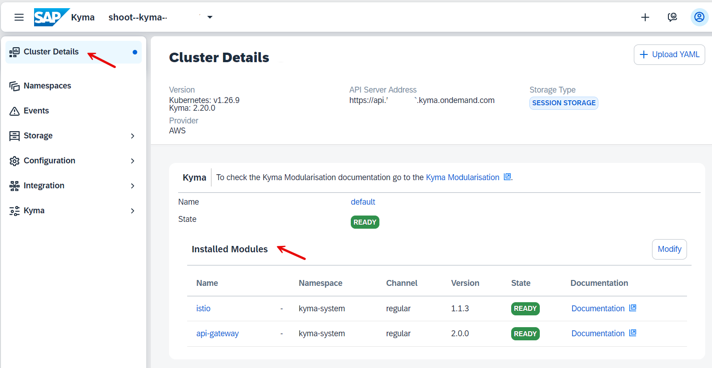
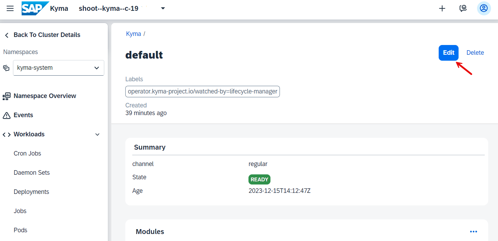
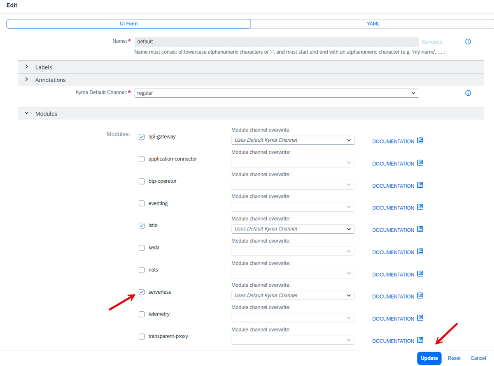

# Setup SAP BTP, Kyma Runtime

<!-- description --> SAP BTP, Kyma Runtime provides a fully managed Kubernetes runtime based on the open-source project [Kyma](https://kyma-project.io/#/).
With this cloud-native solution, developers can extend SAP solutions with serverless Functions and combine them with containerized microservices.

## You will learn

  - Create a Subaccount for Enterprise Accounts or enter your Trial Subaccount
  - Entitle your Subaccount for Kyma runtime
  - Enable Kyma Runtime
  - Access your Kyma Dashboard
  - Create and deploy a "Hello-World" Node.js function

## Prerequisites

You need either a BTP Enterprise Account with unused Kyma entitlement, or a BTP Trial Account.

## Intro

SAP BTP, Kyma runtime provides a fully managed Kubernetes runtime based on the open-source project "Kyma". With this cloud-native solution, developers can extend SAP solutions with serverless Functions and combine them with containerized microservices.

### Create a Subaccount for Kyma Runtime

You can use an existing subaccount of your BTP Global Enterprise Account and enable Kyma, or you create a new subaccount for this tutorial.

In this step of the tutorial you create a new subaccount for your Kyma environment.

>Note: In a BTP **Trial Account**, a subaccount with Kyma entitlement is already preconfigured. You could create a 2nd Subaccount in Trial also, but you will not have unused entitlements for Kyma. You need to delete the Kyma entitlement in the preconfigured Subaccount first.

#### Procedure

1. Navigate to your Global Account Account Explorer,  the home page of your Global Account.

    Select **Create --> Subaccount**.
   
    

2. Provide a **Name** and your preferred **Region**. 

    For more details about Regions where Kyma is available, see [Discovery Center](https://discovery-center.cloud.sap/serviceCatalog/kyma-runtime?region=all). 

    Optional: You may also change the name of your **Subdomain**. The subdomain will become part of the URL for accessing applications that you subscribe to from this subaccount. The subdomain must be unique across all subaccounts in the same region. Uppercase and lowercase will not differentiate subdomains.

    

3. The Subaccount will be created.

    

4. Enter your subaccount 

    

5. Scroll down to **Entitlements**.

    The pre-configured services for a new subaccount are shown.
   
    

### Entitle your Subaccount for Kyma Runtime

If you use a BTP Trial Account, you are already entitled to use the **Kyma runtime** Service. 

If you use a BTP Enterprise Account, you are not yet entitled to for the **Kyma runtime** Service. 

#### Procedure

1. In your subaccount, navigate to **Entitlements --> Entity Assignments**. 

    Select as Entity your subaccount (e.g. the just created subaccount_for_kyma).

    Put **Kyma** into the search field. In a new subaccount you will see no existing entitlements.

    Press button **Configure Entitlements**.

    

2. A new button appears. Select **Add Service Plan**.

    

3. A pop-up window will come up. Search for **Kyma** in "All Solutions".

    Select **Kyma Runtime**. 

    And select your **Service Plan** of choice. 
    
    Press **Add 1 Service Plan**. 

    

4. Increase optionally your "Subaccount Assignment". For training keep "1". 

    Press **Save**.

    

5. Your entitlements will be saved.

6. Double-check your entitlements when done:

    

### Enable Kyma in your Subaccount

Once your subaccount is entitled to use Kyma Runtime, you can "Enable Kyma" in your Subaccount.

**Procedure**

1. Enter the subaccount you created for your Kyma environment.
   
    

2. In your Subaccount **Overview**, select **Kyma Environment** in your page navigation.

    Press button **Enable Kyma**

    
   
3. Kyma Wizard Step 1: In the pop-up wizard, select your **Plan**. This will define the Infrastructure Provider.

    Keep the generated Instance Name and Cluster Name   

    

4. Kyma Wizard Step 2: Simply keep the default values and leave the empty fields empty.
   
    

5. Kyma Wizard Step 3: Review the instance details.

    If everything is ok, choose **Create**

    

6. The Kyma cluster is created. This will take a while. 

    

7. Once the cluster is created you are able to enter the Kyma dashboard.

    Click "Link to dashboard".

    

8. If you use the pre-configured SAP Identity Provider in your Enterprise or Trial Account    **2-Factor-Authentication** is enabled and will be enforced. 

    Choose your **authenticator app** of choice on your mobile phone. 

    Open the app on your mobile and press e.g. **+** to add a new **account**. Choose **Other Account** if asked. 

    Scan the **QR Code**. A password to access Kyma will be created. Enter this password:
 
    

9. Congratulations, you have entered the Kyma dashboard! 

    >Note: Only two Kyma modules are pre-installed.

    

### Enable SAP BTP Kyma Modules

To use additional Kyma modules, you must enable a module first. Use Kyma dashboard or Kyma CLI to do that. If you don't need the module anymore, disable it to save resources.

In this tutorial, you use the default release channel "regular channel". You can also choose "Fast Channel". For more information, see [Kyma Release Channels](https://help.sap.com/docs/btp/sap-business-technology-platform/kyma-s-modular-approach?locale=en-US).

If you want to enable additional modules, follow this procedure:

#### Procedure

1. In your BTP Cockpit goto your subaccount, choose Services and the Instances and Subscriptions.

2. In your Instances and Subscriptions home page, scroll down to your Environments, choose the line "Kyma Environment" and clikc on three dots `...`. Choose "Go to Dasboard". 

3. Your Kyma Dashboard opens. You are on the "Cluster Details" home page.

    Click "Modify".

    

4. You enter your "default" Kyma Namepace.

    Click on "Edit".

    

5. Add the serverless Kyma module by selecting it. You will need it, when you create a Kyma function.

    Click "Update".

    

6. The module will be added. You can see the progress in your Cluster Details home page.

    

    It takes a while to complete.

    

7. Once done, click on the serverless module.

    

    You will be forwarded to your default Namespace. The Workload "functions" is now available.

    

Congratulations! You enabled the serverless Functions in Kyma. 