# Set up SAP BTP, Kyma Runtime

<!-- description --> SAP BTP, Kyma runtime provides a fully managed Kubernetes runtime based on the open-source project Kyma. 
With this cloud-native solution, developers can extend SAP solutions with serverless Functions and combine them with containerized microservices.

## You will learn

  - Create a Subaccount for Enterprise Accounts or enter your Trial Subaccount
  - Entitle your Subaccount for Kyma runtime
  - Enable Kyma Runtime

## Prerequisites

You need either a BTP Enterprise Account with unused Kyma entitlement or a BTP Trial Account.

## Intro

>Note: If you follow this tutorial as part of a mission from SAP Discovery Center, consider using the 'Quick Account Set Up' instead as it will complete the steps outlined here for you. However, if you prefer to do the steps manually, this tutorial is for you.

SAP BTP, Kyma runtime provides a fully managed Kubernetes runtime based on the open-source project [Kyma](https://kyma-project.io/#/). With this cloud-native solution, developers can extend SAP solutions with serverless Functions and combine them with containerized microservices.

### Create a Subaccount for Kyma Runtime

You can use an existing subaccount of your BTP Global Enterprise Account and enable Kyma, or you create a new subaccount for this tutorial.

In this step of the tutorial, you create a new subaccount for your Kyma environment.

>Note: In a BTP **Trial Account**, a subaccount with Kyma entitlement is already preconfigured. You could create a 2nd Subaccount in Trial also, but you will not have unused entitlements for Kyma. You need to delete the Kyma entitlement in the preconfigured Subaccount first.

#### Procedure

1. Navigate to your Global Account Account Explorer,  the home page of your Global Account.

    Select **Create --> Subaccount**.
   
    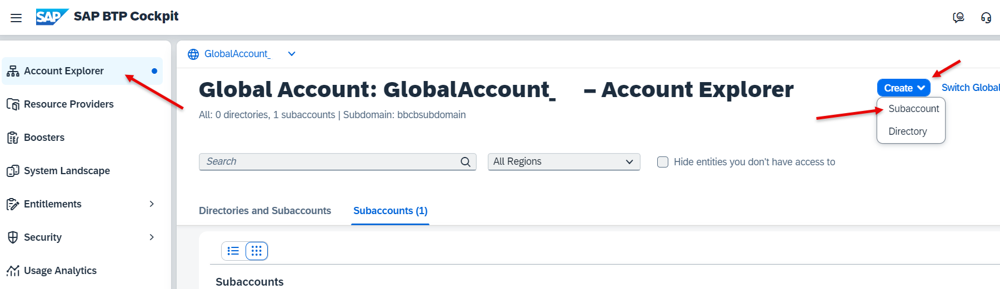

2. Provide a **Name** and your preferred **Region**. 

    For more details about Regions where Kyma is available, see [Discovery Center](https://discovery-center.cloud.sap/serviceCatalog/kyma-runtime?region=all). 

    Optional: You may also change the name of your **Subdomain**. The subdomain will become part of the URL for accessing applications that you subscribe to from this subaccount. The subdomain must be unique across all subaccounts in the same region. Uppercase and lowercase will not differentiate subdomains.

    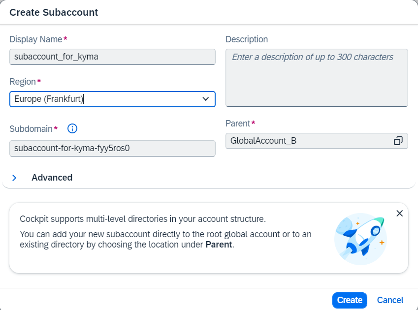

3. The Subaccount will be created.

    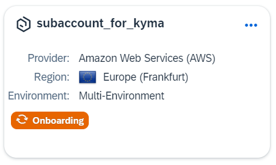

4. Enter your subaccount 

    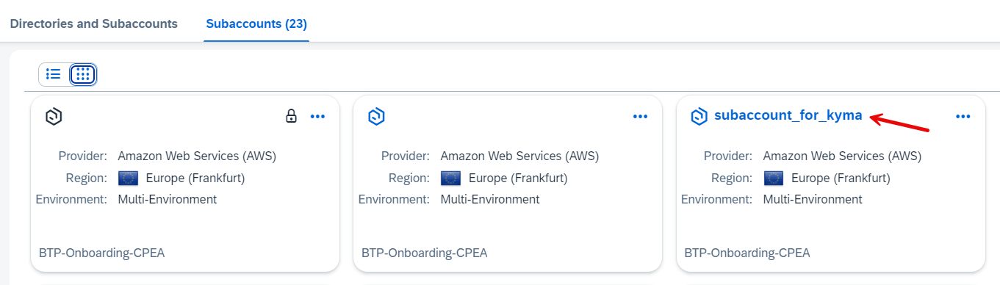

5. Scroll down to **Entitlements**.

    The pre-configured services for a new subaccount are shown.
   
    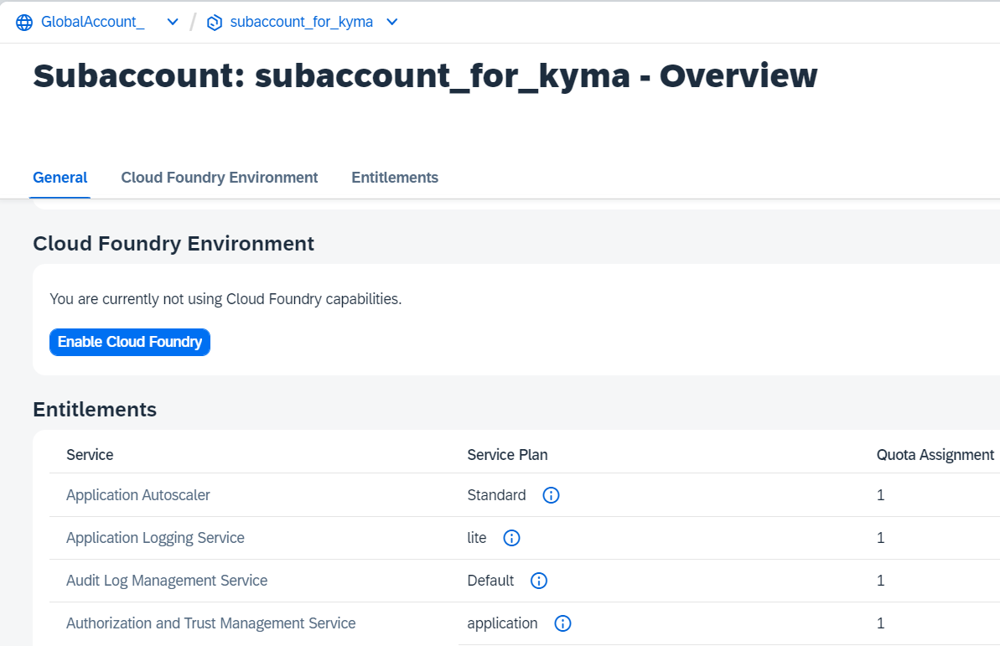

### Entitle your Subaccount for Kyma Runtime

If you use a BTP Trial Account, you are already entitled to use the **Kyma runtime** Service. 

If you use a BTP Enterprise Account, you are not yet entitled to the **Kyma runtime** Service. 

#### Procedure

1. In your subaccount, navigate to **Entitlements --> Entity Assignments**. 

    Select as Entity your subaccount (e.g. the just created subaccount for Kyma).

    Put **Kyma** into the search field. In a new subaccount, you will see no existing entitlements.

    Press button **Configure Entitlements**.

    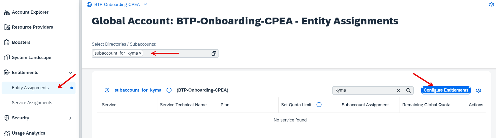

2. A new button appears. Select **Add Service Plan**.

    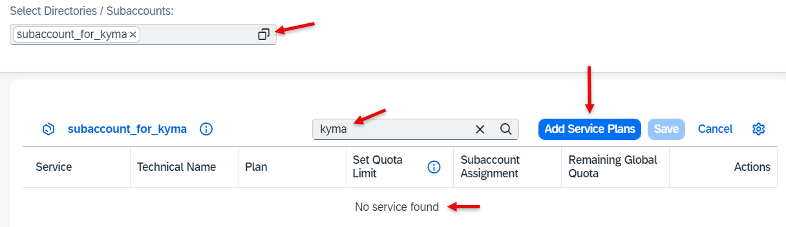

3. A pop-up window will come up. Search for **Kyma** in "All Solutions".

    Select **Kyma Runtime**. 

    And select your **Service Plan** of choice. 
    
    Press **Add 1 Service Plan**. 

    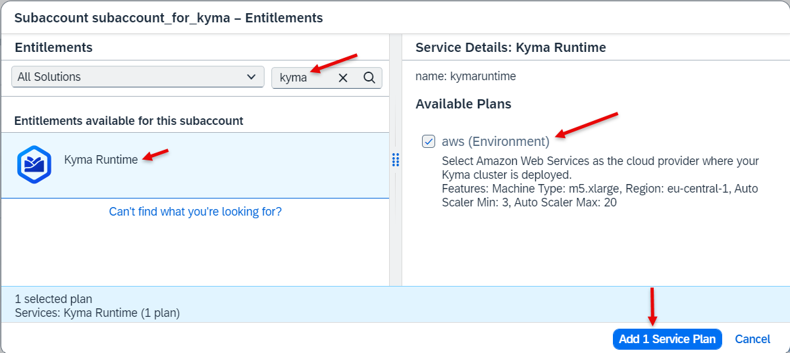

4. Increase your "Subaccount Assignment optionally." For training keep "1". 

    Press **Save**.

    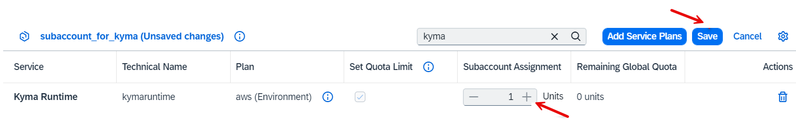

5. Your entitlements will be saved.

6. Double-check your entitlements when done:

    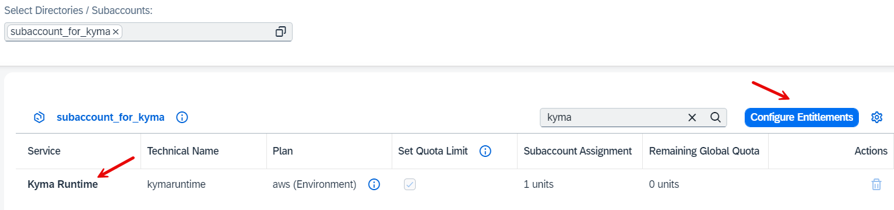

### Enable Kyma in your Subaccount

Once your subaccount is entitled to use Kyma Runtime, you can "Enable Kyma" in your Subaccount.

**Procedure**

1. Enter the subaccount you created for your Kyma environment.
   
    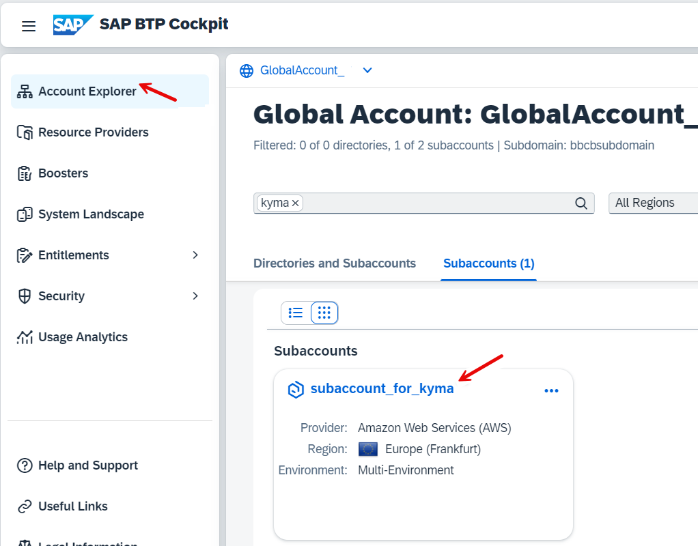

2. In your Subaccount **Overview**, select **Kyma Environment** in your page navigation.

    Press button **Enable Kyma**

    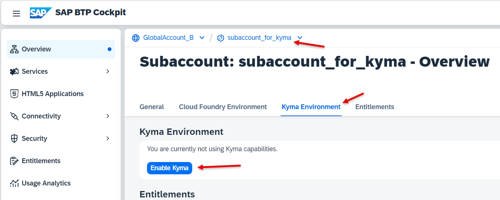
   
3. Kyma Wizard Step 1: In the pop-up wizard, select your **Plan**. This will define the Infrastructure Provider.

    Keep the generated Instance Name and Cluster Name   

    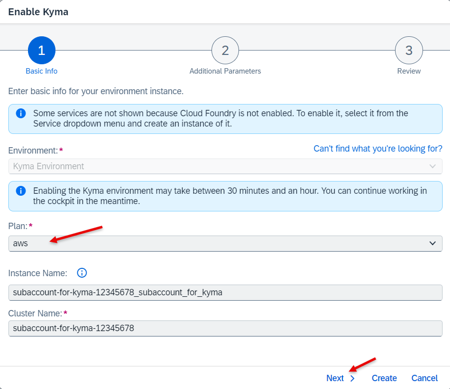

4. Kyma Wizard Step 2: Simply keep the default values and leave the empty fields empty.
   
    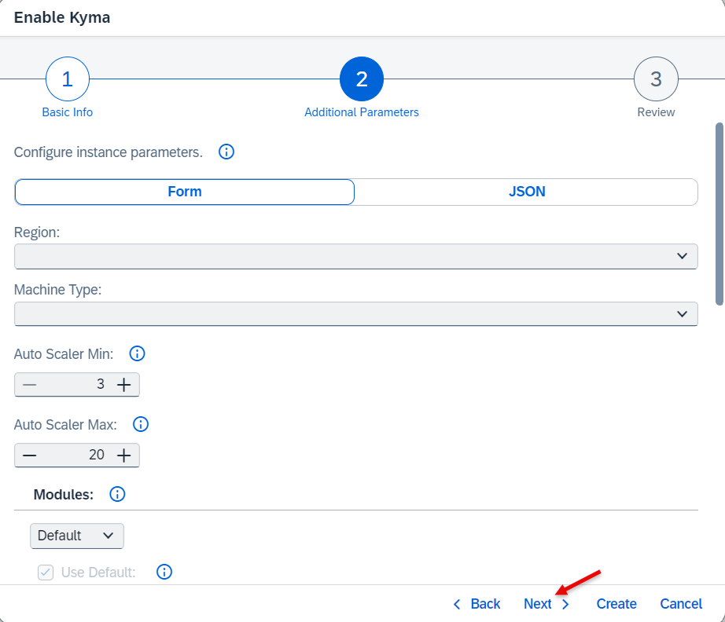

5. Kyma Wizard Step 3: Review the instance details.

    If everything is ok, choose **Create**

    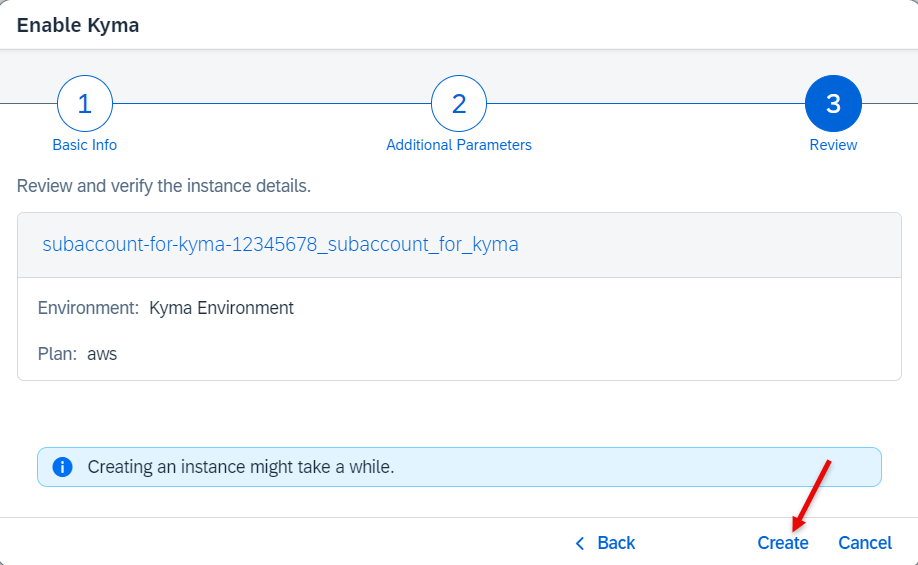

6. The Kyma cluster is created. This will take a while. 

    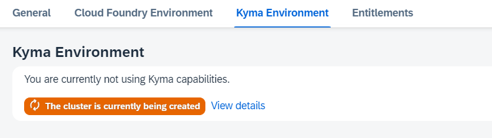

7. Once the cluster is created you will see a link to enter the Kyma dashboard.

    Click "Link to dashboard".

    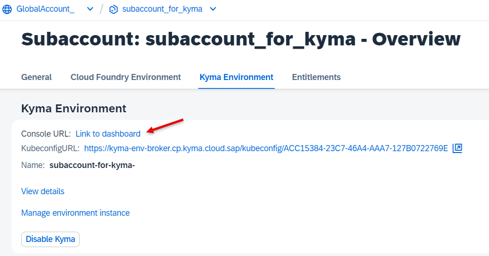

Congratulations! You enabled SAP BTP, Kyma runtime. 
