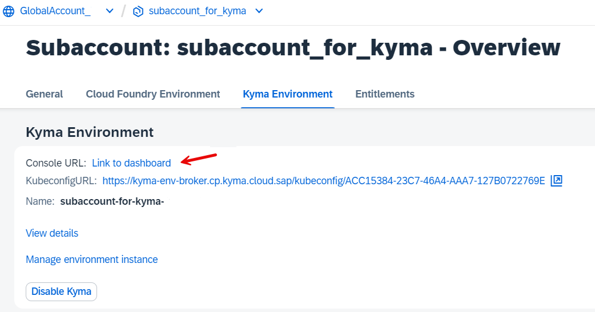
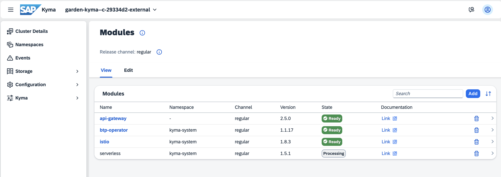
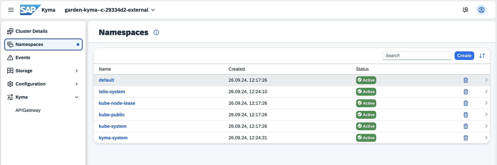
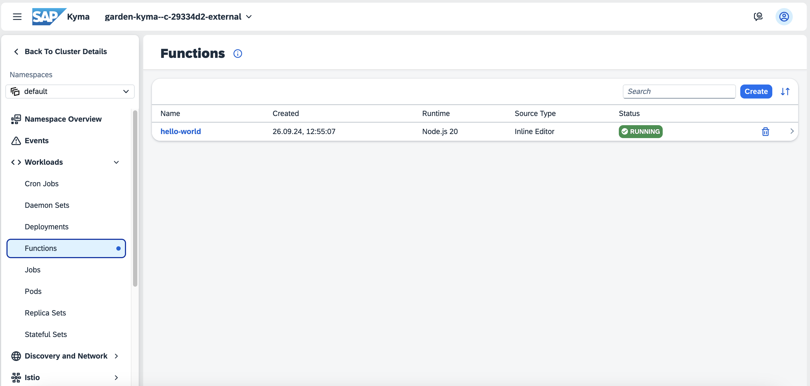

# Create a "Hello-World" Kyma Function and a Microservice

<!-- description -->Once the SAP BTP, Kyma Runtime is entitled and enabled it's time to enable the Kyma module "Serverless", so you can start creating your first function and microservice in Kyma.

In this tutorial, you will use the Kyma Dashboard to enable the Kyma module "Serverless", and create a Kyma function with a microservice. 

## You will learn
  - How to enter Kyma Dashboard
  - How to create a Kyma Function
  - How to create a Kyma Microservice

## Prerequisites

You have created and set up your "SAP BTP, Kyma Environment" either by Quick Account Setup or manually.

### Enter Kyma Dashboard

1. In your BTP Cockpit go to your subaccount, choose Services and the Instances and Subscriptions.

2. On your Instances and Subscriptions home page, scroll down to your Environments, choose the line "Kyma Environment," and click on the three dots `...`. Then, choose **Link to Dashboard**.

    

3. If you use the pre-configured SAP Identity Provider in your Enterprise or Trial Account    **2-Factor-Authentication** is enabled and will be enforced. 

    Choose your **authenticator app** of choice on your mobile phone. 

    Open the app on your mobile and press e.g. **+** to add a new **account**. Choose **Other Account** if asked. 

    Scan the **QR Code**. A password to access Kyma will be created. Enter this password:
 
    

4. Congratulations, you have entered the Kyma dashboard! 

    

### Enable Serverless module

1. Click **Modify Modules**.

    You are at the page with your Kyma modules.

    
    
    >Note: Only a few Kyma modules are pre-installed.
    
    E.g. Istio is an open-source service mesh that provides a uniform way to manage, connect, and secure microservices;

    And Kyma API Gateway Operator is an extension to the Kyma runtime that manages the API Gateway application's configuration and handles resource reconciliation.

2. Click **Add** and the page with modules ready to be enable will open. Select 'Serverless' and click **Add**.

    

    In this tutorial, you use the Serverless module from the default release channel "regular channel". You can also choose "Fast Channel". For more information, see [Kyma Release Channels](https://help.sap.com/docs/btp/sap-business-technology-platform/kyma-s-modular-approach?locale=en-US).

    >Note: You can also enable and disable Kyma modules via Kyma CLI. 

    >Note: At any time you can disable unused modules to save resources.

3.  After you clicked **Add** you are back at the page with all of the enabled modules. Notice the state of the "Serverless" module - for about 2 minutes it will be in the 'Processing' state before it becomes "Ready" like the rest of your enabled modules.

    


4. Once done, click on the **Namespaces** in the left navigation pane, and select "default" namespace.

    

    You will be forwarded to your default Namespace. 

    

    
5. Click **Workloads** on the left navigation pane, and click the new option **Functions**.

    


    Congratulations! You enabled the serverless Functions in Kyma. 


### Create a Hello-World Kyma Function


1. Click **Create**. The "Create Function" wizard opens. 
    

    Choose the template **Default**.

    - Provide a name, e.g. **hello-world**. 

    - Choose **Language** > **JavaScript**. 

    - Choose your **Runtime Version** > e.g. **node.js 20**.

    - Choose **Function Profile** > keep the pre-defined value **XS**.

    - Note that a YAML file will be created under **Source**. 
  
    - You may now also check the other presets, "Advanced" and "YAML".  
    
    - Click **Create**.

4. It will take a few seconds to create the function. The result is a new function **hello-world** in the list of Kyma Functions.

    

    Click on the **hello-world** function and check the "Configuration" tab, it does not have any "API Rules" yet. We need to create one to define the rules of accessing the function via APIs.

    

5. Navigate to **Discovery and Network --> API Rules** on the left navigation pane and click **Create**.

    
   
6. In the editor provide a name, e.g. **hello-rule**

    - As a Service, choose the function you just created: **hello-world**.  
    
    - As a Port, type **80**
    
    - Keep the prefilled Gateway.  

    - You see that the **Host** definition is incomplete. Provide a unique name for the host that is not yet in use. E.g. **hello-host** and replace the wild card.  

    - Keep the **Rules** section as is. 

    - Click **Create**.

    

7. The API Rule "hello-rule" is created. 
   
    Click on the host URL to execute your function in a browser window.

    

   
8. A browser window will open showing the result of the function:

     **`Hello World from the Kyma Function hello-world running on nodejs20!`**
      


### Deploy a Microservice on Kyma

You already know how to deploy and expose a Function. You can do the same with a container microservice. 

You will use the Kyma example **orders-service** for this. The Kyma example "orders-service" is available 

 - on [GitHub](https://github.com/kyma-project/examples/blob/main/orders-service/README.md) 

 - and as a docker image on Google Container Registry `eu.gcr.io/kyma-project/develop/orders-service:68a58069` .`


#### Deploy the Microservice from the Image


1. Open your Kyma dashboard, select your **Namespace**, for example **default**.

2. Select **Workloads --> Deployments** in the left navigation pane of your dashboard.

3. Click on the button `+ Create Deployment` in the detail view.

    

4. Choose the preset **Simple**  and provide the following parameters:

    - Name: `orders-deployment`
    
    - Docker Image: `eu.gcr.io/kyma-project/develop/orders-service:68a58069`
    

    Optional: Choose the preset **Advanced** and provide the following parameters to save resources:
    

    | Profile | Value | Profile | Value |
    | :--- | ---: | :--- | ---: |
    | Memory requests | 10Mi | Memory limits   | 32Mi |
    | CPU requests (m) | 16m | CPU limits (m)  | 20m  |

    

    

5. Click `Create`.

6. A new deployment **orders-deployment** will be created.

    The operation was successful if you can see 1/1 Pods running in the Deployment's view.
   
    


### Create the Service

Once you have the deployment, you can create a Kubernetes Service to allow other Kubernetes resources to communicate with your microservice.

1. Select **Discovery and Network --> Services** in your left-handed dashboard navigation pane

2. Click on the button `+ Create Service` in the detail view.

3. In the "Create Service" view, keep the preset "Simple".

    Provide the following values:

    - name: orders-service

    - app: orders-deployment

    Ports
    
    - name: orders-port
    - Protocol: TCP
    - Port: 80
    - Target Port: 8080 (or other)
    - Application Protocol: HTTP

    

4. A new service, called **orders-service** will be created.


### Expose the microservice

You cannot access and test your new orders-service yet from outside the cluster. 

To expose the microservice, you must create an **API Rule** for it, just like when you exposed our Function.

1. In your Kyma dashboard, go to **Discovery and Network --> API Rules**.

2. Click on `+ Create API Rule`. 

3. A popup window opens. Keep the preset **Simple**.

4. Provide the following values in the Create API Rule view:

    - Name: orders-apirule

    - HTTP Request Timeout: 30 (or any up to 3900)
   
    - Service Name: orders-service (from dropdown list box).

    - Port: 80

    In the section "Gateway", keep the pre-configured Namespace and Name. 

    - Choose your host from the Host dropdown. 
  
    - Replace the wildcard (*) with a name, for example: orders-host

    Keep the values in the section "Rules".

    

5. Choose Create.

    A new API Rule will be created. Status must be **OK**.

6. You can open the link by clicking on the provided URL. The provided link will be empty because the underlying docker image has no home page. 

    The URL has to be extended with the String **/orders**.

    For example: 

    URL: `https://orders-host.c-123456.kyma.ondemand.com/` has to become 
    
    URL: `https://orders-host.c-123456.kyma.ondemand.com/orders` 

    


7. If you extend the URL correctly, you can see your orders: **`[]`**. 

    It is empty, as you have not created orders in this tutorial so far.


#### Create some sample content for your service.

1. First call your service with curl:

    `curl -X GET ${APP_URL}/orders -k`

    Replace `${APP_URL}` with your orders-host URL, for example, `https://orders-host.b1234567.kyma.ondemand.com/`

    The result should be still **`[]`**.

2. "Place" an order:

    Note: Windows User should use a Linux-like bash, like Git Bash in order to simply  copy and paste the sample code.

    Do not forget to define or replace the APP_URL.

    ```bash
    curl -X POST ${APP_URL}/orders -k \
      -H "Content-Type: application/json" -d \
      '{
          "consignmentCode": "76272727",
          "orderCode": "76272725",
          "consignmentStatus": "PICKUP_COMPLETE"
      }'
    ```

3. Call your orders service in your browser again. The orders-service will return the order: 
    
    `[{"orderCode":"76272725","consignmentCode":"76272727","consignmentStatus":"PICKUP_COMPLETE"}]`

    For a complete guide on how to run orders-service, see [kyma-project on GitHub](https://github.com/kyma-project/examples/blob/main/orders-service/README.md)


Congratulations, you created and exposed your first microservice!   
