# Create a "Hello-World" Kyma Function and a Microservice

Once the SAP BTP, Kyma Runtime is entitled and enabled **and** you have enabled the Kyma module "Serverless", you can start to create your first function and microservice in Kyma.

In this tutorial, you will use the Kyma Dashboard to create a Kyma function and microservice. 

## You will learn
  - How to create a Kyma Function
  - How to create a Kyma Microservice

## Prerequisites

You have created and set up your "SAP BTP, Kyma Environment", and enabled the Kyma "Serverless" module.


### Create a Hello-World Kyma Function

Now, as the BTP Service Kyma is entitled and enabled, you can create the first service in Kyma.


**Procedure**

1. In your BTP Cockpit go to your subaccount, choose Services and the Instances and Subscriptions.

2. On your Instances and Subscriptions home page, scroll down to your Environments, choose the line "Kyma Environment," and click on the three dots `...`. Then, choose "Go to Dashboard." 

3. Your Kyma Dashboard opens. You are on the "Cluster Details" home page.

    Choose "Namespaces" on the left-handed navigation pane and select **default** in the list of namespaces.
    
    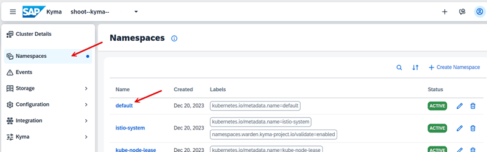

4. In the default Namespace, select **Workloads --> Functions** and select **+ Create Function**.

    >Note: If the module "Functions" is not shown, you have not yet enabled the module "Serverless". See the tutorial "Setup SAP BTP, Kyma Runtime" for more information.

    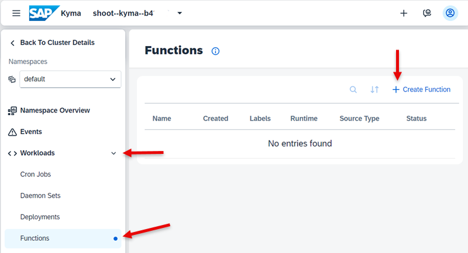

5. The "Create Function" wizard opens. Keep the preset **Simple**.

    - Provide a name, e.g. **hello-world**. 

    - Choose **Language** > **JavaScript**. 

    - Choose your **Runtime Version** > e.g. **node.js 18**.

    - Choose **Function Profile** > keep the pre-defined value **XS**.

    - Note that a YAML file will be created under **Source**. 
  
    - You may now also check the other presets, "Advanced" and "YAML".  
    
    - Choose **Create**.

    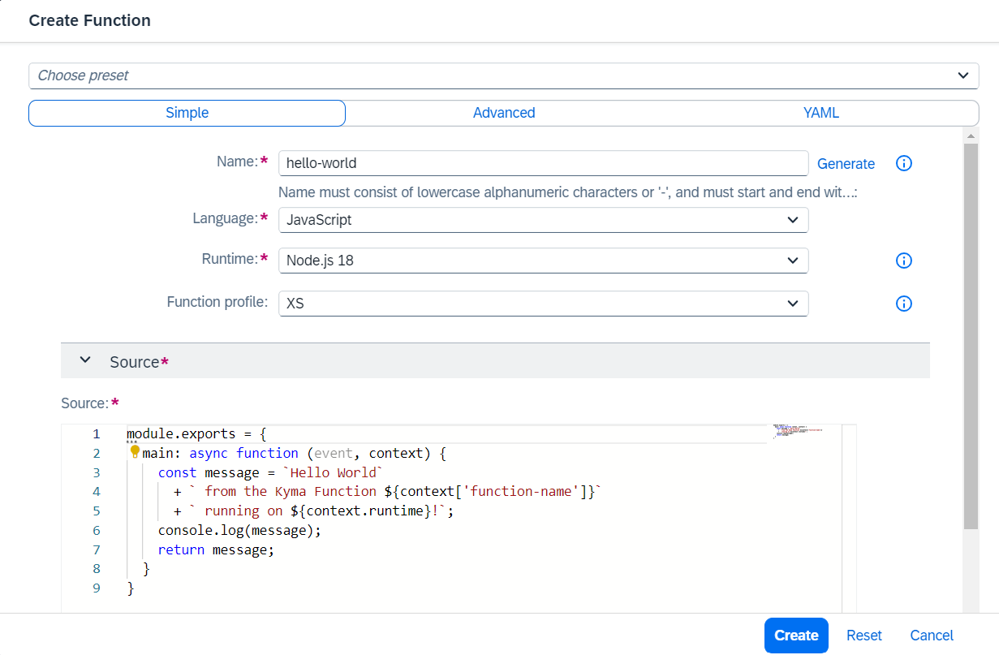


6. It will take some seconds to create the function. The result is a new function **hello-world** in Kyma Functions.

    Check also the configuration of the Function. It does not have "API Rules" yet.

    

7. Navigate to **Discovery and Network --> API Rules**. 

    Select **+ Create API Rule**.

    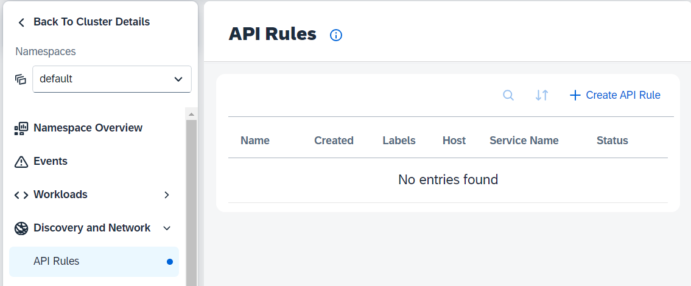
   
8. Provide a name, e.g. **hello-rule**

    - As a Service, choose the function you just created: **hello-world**.  
    
    - Keep the prefilled Gateway.  

    - You see that the **Host** definition is incomplete. Provide a unique name for the host that is not yet in use. E.g. **hello-host** and replace the wild card.  

    - Keep the **Rules** section as is. 

    - Choose **Create**.
      
    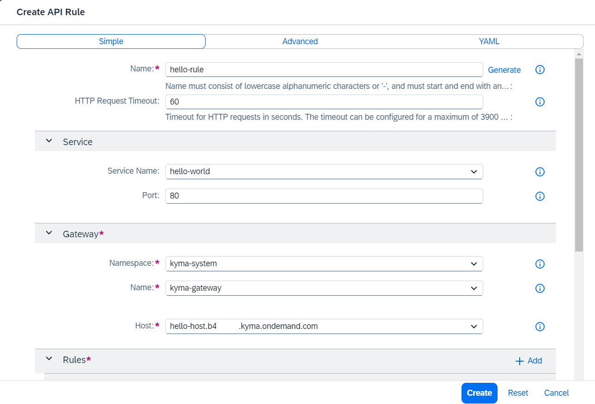

9. The API Rule "hello-rule" is created. 
   
    Click on the host URL to execute your function in a browser window.

    

   
10. A browser window will open showing the result of the function:

     **`Hello World from the Kyma Function hello-world running on nodejs18!`**
      
11. You may also execute your function under **Workloads --> Functions**. 

     - Select Function "hello-world". 
 
     - Select **Configuration** and you can run the function from here.
      
     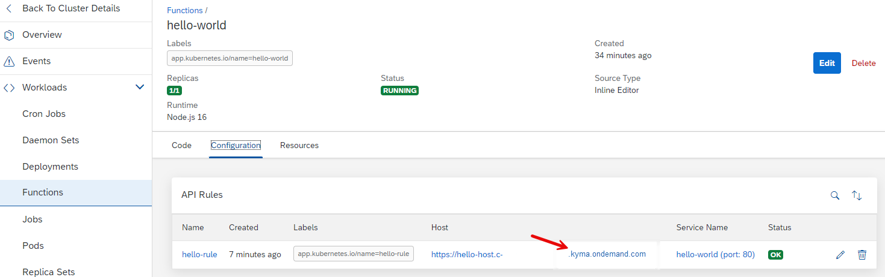


### Deploy a Microservice on Kyma

You already know how to deploy and expose a Function. You can do the same with a container microservice. 

You will use the Kyma example **orders-service** for this. The Kyma example "orders-service" is available 

 - on [GitHub](https://github.com/kyma-project/examples/blob/main/orders-service/README.md) 

 - and as a docker image on Google Container Registry `eu.gcr.io/kyma-project/develop/orders-service:68a58069` .`


#### Deploy the Microservice from the Image


1. Open your Kyma dashboard in your BTP Kyma subaccount.

2. Select your **Namespace**, for example **default**.

3. Select **Workloads --> Deployments** in the left navigation pane of your dashboard.

4. Click on the button `+ Create Deployment` in the detail view.

    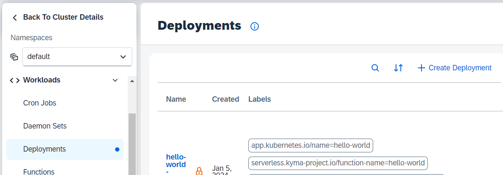

5. Choose the preset **Simple**  and provide the following parameters:

    - Name: `orders-deployment`
    
    - Docker Image: `eu.gcr.io/kyma-project/develop/orders-service:68a58069`
    

    Optional: Choose the preset **Advanced** and provide the following parameters to save resources:
    

    | Profile | Value | Profile | Value |
    | :--- | ---: | :--- | ---: |
    | Memory requests | 10Mi | Memory limits   | 32Mi |
    | CPU requests (m) | 16m | CPU limits (m)  | 20m  |

    

    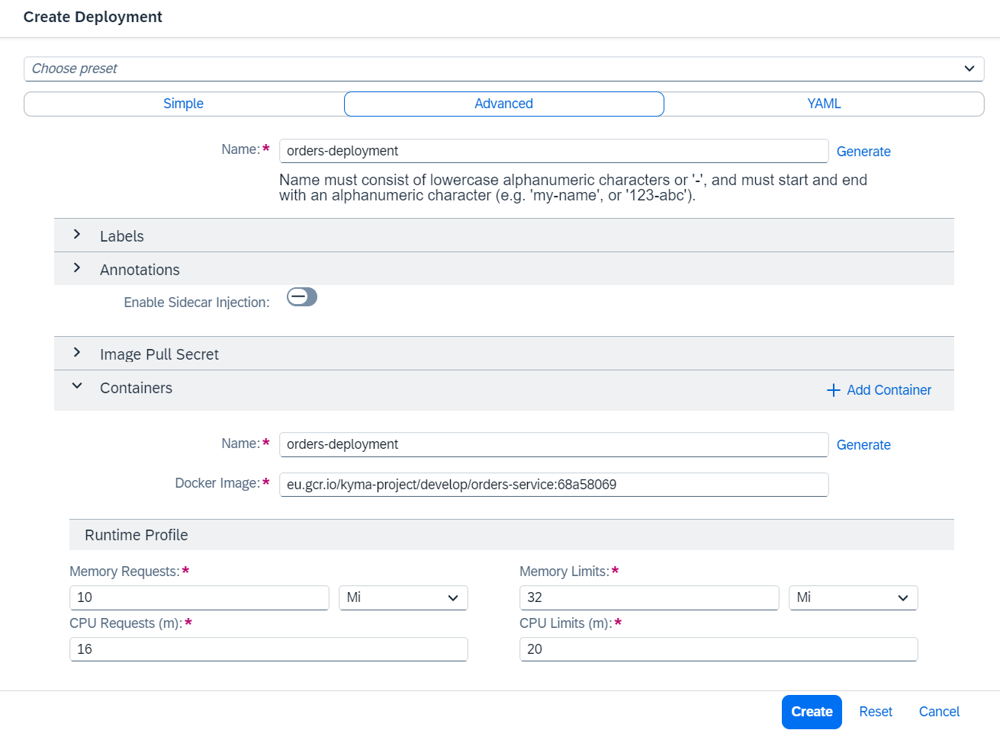

6. Click `Create`.

7. A new deployment **orders-deployment** will be created.

    The operation was successful if you can see 1/1 Pods running in the Deployment's view.
   
    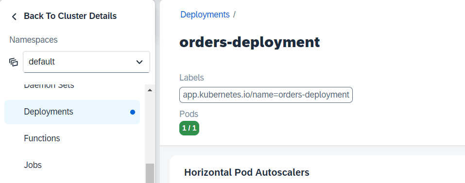


### Create the Service

Once you have the deployment, you can create a Kubernetes Service to allow other Kubernetes resources to communicate with your microservice.

1. Select **Discovery and Network --> Services** in your left-handed dashboard navigation pane

2. Click on the button `+ Create Service` in the detail view.

3. In the "Create Service" view, keep the preset "Simple".

    Provide the following values:

    - name: orders-service

    - app: orders-deployment

    Ports
    
    - name: orders-port
    - Protocol: TCP
    - Port: 80
    - Target Port: 8080 (or other)
    - Application Protocol: HTTP

    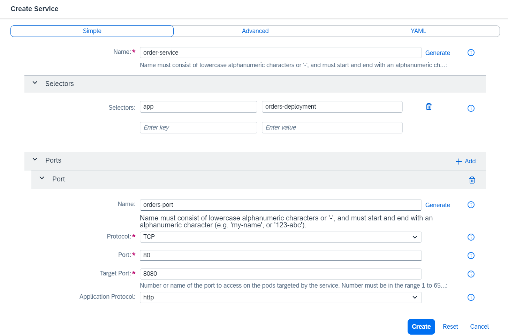

4. A new service, called **orders-service** will be created.


### Expose the microservice

You cannot access and test your new orders-service yet from outside the cluster. 

To expose the microservice, you must create an **API Rule** for it, just like when you exposed our Function.

1. In your dashboard, go to **Discovery and Network --> API Rules**.

2. Click on `+ Create API Rule`. 

3. A popup window opens. Keep the preset **Simple**.

4. Provide the following values in the Create API Rule view:

    - Name: orders-apirule

    - HTTP Request Timeout: 30 (or any up to 3900)
   
    - Service Name: orders-service (from dropdown list box).

    - Port: 80

    In the section "Gateway", keep the pre-configured Namespace and Name. 

    - Choose your host from the Host dropdown. 
  
    - Replace the wildcard (*) with a name, for example: orders-host

    Keep the values in the section "Rules".

    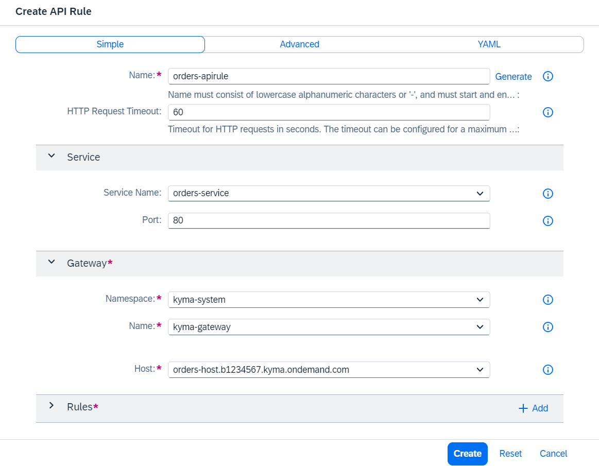

5. Choose Create.

    A new API Rule will be created. Status must be **OK**.

6. You can open the link by clicking on the provided URL. The provided link will be empty because the underlying docker image has no home page. 

    The URL has to be extended with the String **/orders**.

    For example: 

    URL: `https://orders-host.c-123456.kyma.ondemand.com/` has to become 
    
    URL: `https://orders-host.c-123456.kyma.ondemand.com/orders` 

    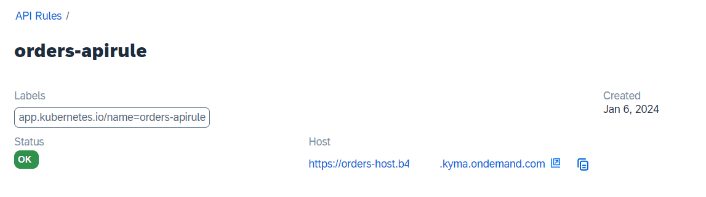


7. If you extend the URL correctly, you can see your orders: **`[]`**. 

    It is empty, as you have not created orders in this tutorial so far.


#### Create some sample content for your service.

1. First call your service with curl:

    `curl -X GET ${APP_URL}/orders -k`

    Replace `${APP_URL}` with your orders-host URL, for example, `https://orders-host.b1234567.kyma.ondemand.com/`

    The result should be still **`[]`**.

2. "Place" an order:

    Note: Windows User should use a Linux-like bash, like Git Bash in order to simply  copy and paste the sample code.

    Do not forget to define or replace the APP_URL.

    ```bash
    curl -X POST ${APP_URL}/orders -k \
      -H "Content-Type: application/json" -d \
      '{
          "consignmentCode": "76272727",
          "orderCode": "76272725",
          "consignmentStatus": "PICKUP_COMPLETE"
      }'
    ```

3. Call your orders service in your browser again. The orders-service will return the order: 
    
    `[{"orderCode":"76272725","consignmentCode":"76272727","consignmentStatus":"PICKUP_COMPLETE"}]`

    For a complete guide on how to run orders-service, see [kyma-project on GitHub](https://github.com/kyma-project/examples/blob/main/orders-service/README.md)


Congratulations, you created and exposed your first microservice!   
